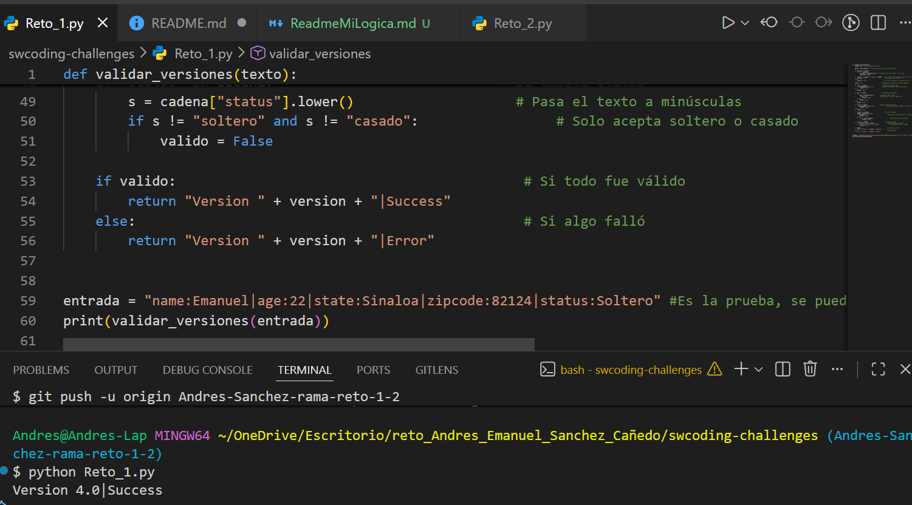
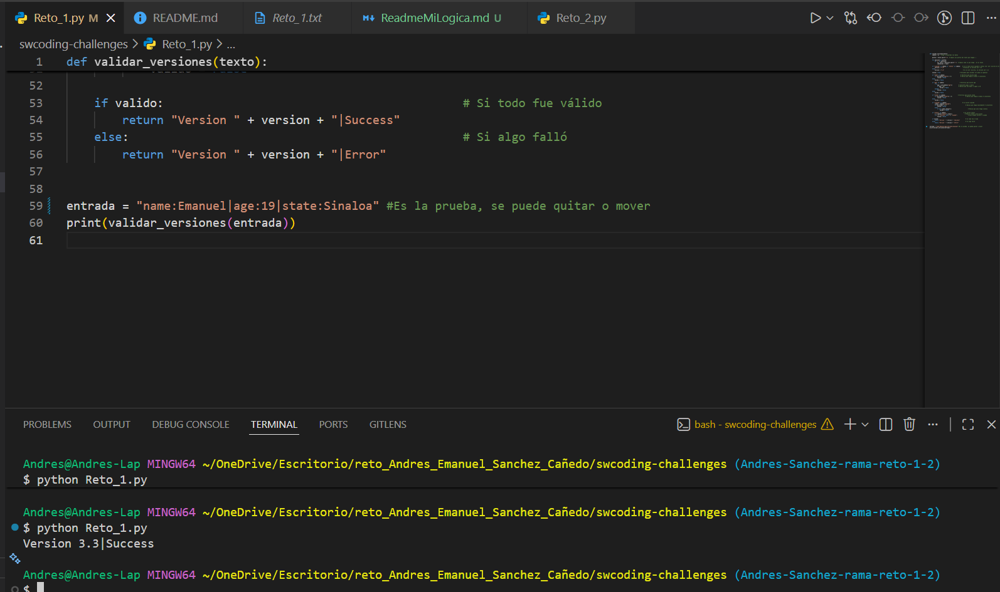
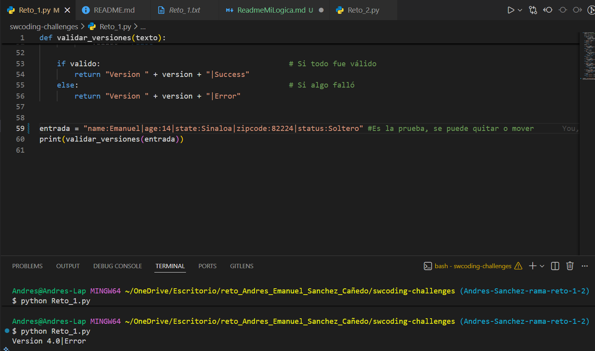
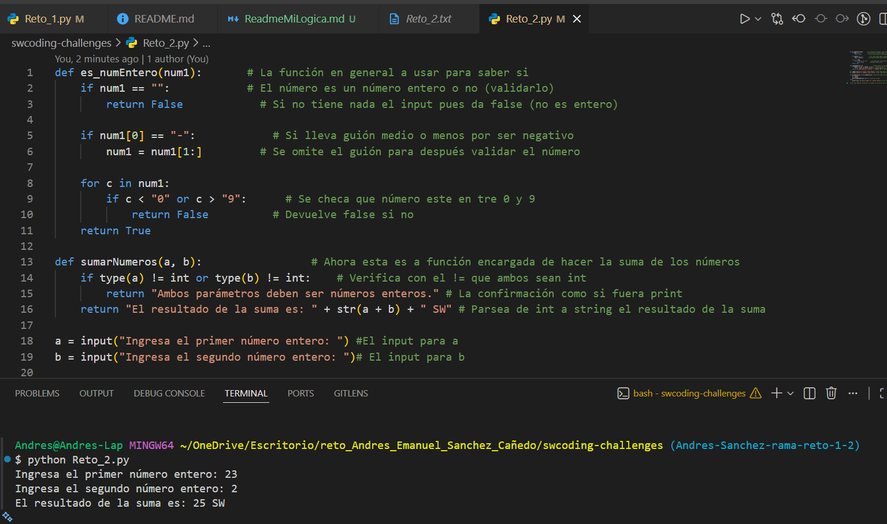

swcoding-challenges
Challenges

# Retos de Programación

Reto 1

El programa se desarrolló tratando de mantener una estructura sencilla de if's y else tipo cascada que fuesen resolviendo punto por punto los temas pedidos. En general se mantuvo con esa estructura para seguir con el orden y se usaron funciones y métodos sencillos de entender que son de mucha utilidad en el problema descrito. 
Split() se usó para separar las palabras de los : y |
len() para ver la longitud que los textos y que, por consecuencia cumplieran con lo pedido.
Try() y except() para validar la edad que sea numérica
lower() para evitar conflictos con las mayúsc.
isdigit() perfecto para el manejo de enteros positivos.

Mantuve la resolución sencilla como se pedía, donde si el zipcode o status van como deben ir, era version 4.0 y si no 3.3
Adjunto evidencia de una muestra válida.

Ahora una donde al ser removidos zipcode y status lanza Success pero con la versión 3.3

Por último, el caso en el que da error debido a que se es menor de edad.

    Reto 2
    En este reto se manejó algo igual de simplificado, empezando por lo básico que es definir la función general, que los datos ingresados por el usuario en los input sean válidos, así como que sea un número entero el negativo, parseo de int a string con str y se evitó el uso de isdigit debido a los números negativos, se que es posible usarlo, pero consideré apropiado desarrollar el ejercicio sin usarlo ya que lo usé en el reto 1.
    Posterior a esto, se hizo la función para la suma de los número (junto con el parseo como se mencionó antes) finalizando así con la entrada del usuario para después ser impresa la suma de los inputs.
    En este código se manejaron igual if else, se usó el return para impresiones y variables true false, así como validar un input no vacío.

    Nota: Se pedían comentarios y lo llené de estos mismos tratando de explicar que hace cada cosa.
    Imagen del funcionamiento:
    
